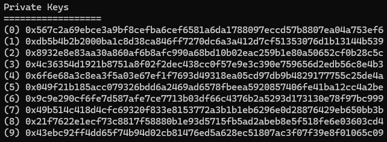

# EtherConsole

EtherConsole es una aplicación de consola en C# que permite almacenar y recuperar datos en la blockchain de Ethereum. Este proyecto sirve como una implementación básica para demostrar (demo técnica) cómo interactuar con Ethereum desde C# en .Net.

## Características

- Almacenamiento de datos (strings) en la blockchain de Ethereum
- Recuperación de datos almacenados mediante el hash de la transacción
- Visualización de metadatos de las transacciones (fecha, dirección de origen, destino, etc.)
- Compatible con cualquier red Ethereum (principal, pruebas o local)

## Requisitos

- .NET 6.0 o superior
- Una red Ethereum accesible (puede ser local como Ganache o una red pública)
- Se propone como opción de pruebas montar un nodo Ethereum con Ganache mediante Docker

## Instalación

1. Clona este repositorio:
```
git clone git@github.com:CarlosCarmonaTortosa/EtherConsole.git
```

2. Abrir en Visual Studio 2022 y 'Limpiar' la solución para instalar / actualizar las dependencias

3. Si se opta por usar un nodo local de pruebas (sin coste económico de transacción en la red blockchain, el Gas) se propone el uso de un contenedor Docker de Ganache (por supuesto, se puede usar una cuenta real con un nodo real de Ethereum, pero esto tendrá un coste económico):
```
docker run -p 8545:8545 trufflesuite/ganache-cli ganache-cli -h 0.0.0.0
```

## Imagen de Docker Ganache (para entorno de desarrollo)

Arrancar contenedor:


Obtener clave privada. Se generan 10 claves privadas de prueba con 100 ETH cada una. Copiaremos cualquiera de ellas para establecerla en Program.cs en la variable privateKey:




## Configuración

Antes de ejecutar la aplicación, es necesario configurar la URL del nodo Ethereum y la clave privada en el archivo `Program.cs`:

```csharp
string nodeUrl = "http://localhost:8545"; // Cambia a la URL de tu nodo (mantener si usamos el anterior contenedor Docker de Ganache)
string privateKey = "TU_CLAVE_PRIVADA"; // Reemplaza con tu clave privada (o una clave privada de pruebas de Ganache, anteriormente explicado)
```

## Uso

Compila y ejecuta la aplicación:

```
dotnet run
```

### Ejemplo de funcionamiento

1. La aplicación envía un mensaje a la blockchain de Ethereum
2. Se obtiene el hash de la transacción
3. Se espera a que la transacción sea minada
4. Se recupera la información de la transacción, incluyendo el mensaje original

Mostrará en consola el resultado de insertar texto en la blockchain de Ethereum (escritura) y la lectura de dicha información de la red de blockchain mediante la clave HASH (lectura)


Si estamos usando el contenedor Docker de Ganache, veremos las operaciones en la red blockchain desde la consola de Docker


### Personalización

Para personalizar el mensaje que se envía a la blockchain, modifica la siguiente línea en `Program.cs`:

```csharp
string message = "Mensaje a insertar en la blockchain de Ethereum";
```

## Arquitectura

El proyecto sigue un patrón de diseño basado en interfaces (IoC):

- `IEthereumData`: Define las operaciones para interactuar con Ethereum
- `EthereumData`: Implementa las operaciones utilizando Nethereum

La inyección de dependencias se configura en `Program.cs` para facilitar pruebas unitarias y cambios en la implementación.

## Limitaciones

- Las transacciones en la blockchain de Ethereum no son gratuitas y requieren Gas (no en la versión Docker de Ganache, como entorno de desarrollo)
- El almacenamiento de datos en la blockchain no es eficiente para grandes cantidades de información
- Este proyecto es educativo (es una demo técnica) y no debe usarse en producción sin revisiones adicionales (vale como punto de partida)
- Este mismo código, con modificaciones sencillas mediante el chain (ver documentación de Nethereum en https://nethereum.com) permitirá también realizar transacciones con sistemas más baratos como Polygon, Avalanche o Fantom, entre otros muchos

## Licencia

[MIT](LICENSE)
